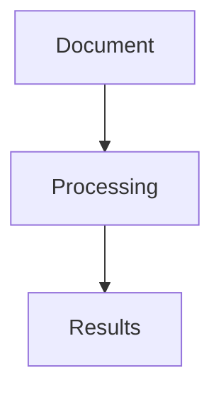

# GenAI IDP Accelerator Documentation

This directory contains the documentation for the GenAI IDP Accelerator for Terraform, built using [Material for MkDocs](https://squidfunk.github.io/mkdocs-material/).

## Quick Start

### Prerequisites

- Python 3.8 or higher
- pip package manager

### Setup

1. **Install dependencies**:

   ```bash
   pip install -r requirements.txt
   ```

2. **Serve locally**:

   ```bash
   mkdocs serve
   ```

3. **Open in browser**:
   Navigate to <http://127.0.0.1:8000>

### Using Make

Alternatively, use the provided Makefile:

```bash
# Install dependencies
make install

# Serve documentation
make serve

# Build for production
make build
```

## Documentation Structure

```
docs/
├── mkdocs.yml              # MkDocs configuration
├── requirements.txt        # Python dependencies
├── Makefile               # Common tasks
├── README.md              # This file
└── content/               # Documentation content
    ├── index.md           # Homepage
    ├── .pages.yml         # Navigation configuration
    ├── getting-started/   # Getting started guides
    ├── terraform-modules/ # Module documentation
    ├── examples/          # Usage examples
    ├── deployment-guides/ # Deployment guides
    ├── faqs/             # Frequently asked questions
    ├── contributing/     # Contribution guidelines
    └── assets/           # Images and other assets
```

## Writing Documentation

### Markdown Guidelines

- Use clear, concise language
- Include code examples where appropriate
- Add diagrams using Mermaid syntax
- Use admonitions for important information

### Code Examples

Use fenced code blocks with language specification:

```hcl
resource "aws_s3_bucket" "example" {
  bucket = var.bucket_name
  
  tags = var.tags
}
```

### Admonitions

Use admonitions to highlight important information:

```markdown
!!! info "Information"
    This is an informational note.

!!! warning "Warning"
    This is a warning message.

!!! tip "Tip"
    This is a helpful tip.
```

### Diagrams

Use Mermaid for diagrams:

```markdown


```

### Navigation

Navigation is controlled by `.pages.yml` files in each directory:

```yaml
nav:
  - index.md
  - getting-started
  - examples
```

## Building and Deployment

### Local Development

```bash
# Serve with live reload
mkdocs serve

# Build static site
mkdocs build
```

### Production Build

```bash
# Build optimized version
mkdocs build

# The built site will be in the site/ directory
```

### Deployment Options

1. **Static hosting** (S3, Netlify, etc.):

   ```bash
   mkdocs build
   # Upload site/ directory contents
   ```

2. **GitHub Pages**:

   ```bash
   mkdocs gh-deploy
   ```

## Configuration

### MkDocs Configuration

The main configuration is in `mkdocs.yml`:

- **Site information**: Name, description, URLs
- **Theme configuration**: Material theme settings
- **Plugins**: Additional functionality
- **Markdown extensions**: Enhanced markdown features

### Theme Customization

The Material theme can be customized:

- **Colors**: Primary and accent colors
- **Fonts**: Typography settings
- **Features**: Navigation and content features
- **Logo and favicon**: Branding elements

## Content Guidelines

### File Organization

- Use descriptive filenames
- Group related content in directories
- Maintain consistent structure across sections

### Writing Style

- Write for your audience (developers, operators, etc.)
- Use active voice
- Include practical examples
- Provide step-by-step instructions

### Code Examples

- Test all code examples
- Include complete, working examples
- Add comments to explain complex parts
- Use realistic variable names and values

## Maintenance

### Regular Tasks

- Update dependencies: `pip install -r requirements.txt --upgrade`
- Check for broken links: `make check-links`
- Update module documentation: `make generate-module-docs`
- Review and update content regularly

### Quality Checks

- Lint markdown files: `make lint`
- Test all examples and code snippets
- Verify links and references
- Check spelling and grammar

## Contributing

See the [Contributing Guide](content/contributing/documentation.md) for detailed information on contributing to the documentation.

### Quick Contribution Steps

1. Fork the repository
2. Create a branch for your changes
3. Make your edits
4. Test locally with `mkdocs serve`
5. Submit a merge request

## Troubleshooting

### Common Issues

**MkDocs not found**:

```bash
pip install mkdocs
```

**Theme not found**:

```bash
pip install mkdocs-material
```

**Plugin errors**:

```bash
pip install -r requirements.txt
```

**Port already in use**:

```bash
mkdocs serve -a 127.0.0.1:8001
```

### Getting Help

- Check the [MkDocs documentation](https://www.mkdocs.org/)
- Review [Material for MkDocs docs](https://squidfunk.github.io/mkdocs-material/)
- Open an issue in the repository

## Resources

- [MkDocs Documentation](https://www.mkdocs.org/)
- [Material for MkDocs](https://squidfunk.github.io/mkdocs-material/)
- [Markdown Guide](https://www.markdownguide.org/)
- [Mermaid Diagrams](https://mermaid-js.github.io/mermaid/)
