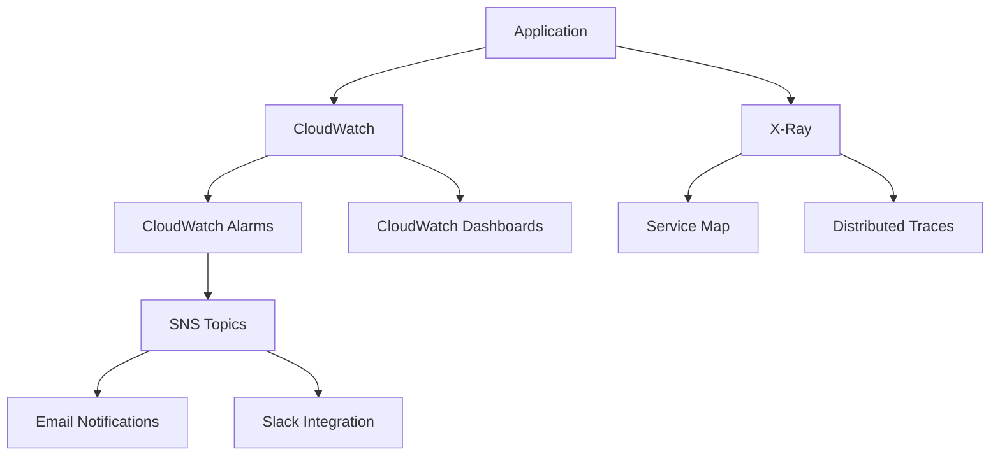

# Monitoring and Observability Guide

This guide covers comprehensive monitoring, logging, and observability setup for the GenAI IDP Accelerator.

## Monitoring Architecture

### Three Pillars of Observability

1. **Metrics**: Quantitative measurements of system behavior
2. **Logs**: Detailed records of events and transactions
3. **Traces**: Request flow through distributed components

### Monitoring Stack



## CloudWatch Configuration

### Log Groups

```hcl
# Lambda function log groups
resource "aws_cloudwatch_log_group" "lambda_logs" {
  for_each = var.lambda_functions
  
  name              = "/aws/lambda/${var.environment}-idp-${each.key}"
  retention_in_days = var.log_retention_days
  kms_key_id        = aws_kms_key.cloudwatch_logs_key.arn
  
  tags = local.common_tags
}

# API Gateway log group
resource "aws_cloudwatch_log_group" "api_gateway_logs" {
  name              = "/aws/apigateway/${var.environment}-idp-api"
  retention_in_days = var.log_retention_days
  kms_key_id        = aws_kms_key.cloudwatch_logs_key.arn
  
  tags = local.common_tags
}

# Step Functions log group
resource "aws_cloudwatch_log_group" "step_functions_logs" {
  name              = "/aws/stepfunctions/${var.environment}-idp-workflow"
  retention_in_days = var.log_retention_days
  kms_key_id        = aws_kms_key.cloudwatch_logs_key.arn
  
  tags = local.common_tags
}
```

### Custom Metrics

```hcl
# Custom metric filters
resource "aws_cloudwatch_log_metric_filter" "document_processing_duration" {
  name           = "${var.environment}-document-processing-duration"
  log_group_name = aws_cloudwatch_log_group.lambda_logs["document_processor"].name
  pattern        = "[timestamp, request_id, \"PROCESSING_DURATION\", duration]"
  
  metric_transformation {
    name      = "DocumentProcessingDuration"
    namespace = "IDP/Performance"
    value     = "$duration"
    unit      = "Seconds"
  }
}

resource "aws_cloudwatch_log_metric_filter" "document_processing_errors" {
  name           = "${var.environment}-document-processing-errors"
  log_group_name = aws_cloudwatch_log_group.lambda_logs["document_processor"].name
  pattern        = "[timestamp, request_id, \"ERROR\", ...]"
  
  metric_transformation {
    name      = "DocumentProcessingErrors"
    namespace = "IDP/Errors"
    value     = "1"
  }
}

resource "aws_cloudwatch_log_metric_filter" "bedrock_api_calls" {
  name           = "${var.environment}-bedrock-api-calls"
  log_group_name = aws_cloudwatch_log_group.lambda_logs["ai_processor"].name
  pattern        = "[timestamp, request_id, \"BEDROCK_API_CALL\", model, tokens]"
  
  metric_transformation {
    name      = "BedrockAPICalls"
    namespace = "IDP/Usage"
    value     = "1"
  }
}
```

## CloudWatch Alarms

### Performance Alarms

```hcl
# Lambda function duration alarm
resource "aws_cloudwatch_metric_alarm" "lambda_duration" {
  for_each = var.lambda_functions
  
  alarm_name          = "${var.environment}-idp-${each.key}-duration"
  comparison_operator = "GreaterThanThreshold"
  evaluation_periods  = "2"
  metric_name         = "Duration"
  namespace           = "AWS/Lambda"
  period              = "300"
  statistic           = "Average"
  threshold           = each.value.timeout_threshold
  alarm_description   = "Lambda function ${each.key} duration is too high"
  
  dimensions = {
    FunctionName = aws_lambda_function.functions[each.key].function_name
  }
  
  alarm_actions = [aws_sns_topic.alerts.arn]
  ok_actions    = [aws_sns_topic.alerts.arn]
  
  tags = local.common_tags
}

# Lambda function error rate alarm
resource "aws_cloudwatch_metric_alarm" "lambda_error_rate" {
  for_each = var.lambda_functions
  
  alarm_name          = "${var.environment}-idp-${each.key}-error-rate"
  comparison_operator = "GreaterThanThreshold"
  evaluation_periods  = "2"
  metric_name         = "Errors"
  namespace           = "AWS/Lambda"
  period              = "300"
  statistic           = "Sum"
  threshold           = "5"
  alarm_description   = "Lambda function ${each.key} error rate is too high"
  
  dimensions = {
    FunctionName = aws_lambda_function.functions[each.key].function_name
  }
  
  alarm_actions = [aws_sns_topic.alerts.arn]
  
  tags = local.common_tags
}

# API Gateway 4xx errors
resource "aws_cloudwatch_metric_alarm" "api_gateway_4xx_errors" {
  alarm_name          = "${var.environment}-idp-api-4xx-errors"
  comparison_operator = "GreaterThanThreshold"
  evaluation_periods  = "2"
  metric_name         = "4XXError"
  namespace           = "AWS/ApiGateway"
  period              = "300"
  statistic           = "Sum"
  threshold           = "10"
  alarm_description   = "API Gateway 4xx error rate is too high"
  
  dimensions = {
    ApiName = aws_api_gateway_rest_api.idp_api.name
  }
  
  alarm_actions = [aws_sns_topic.alerts.arn]
  
  tags = local.common_tags
}

# API Gateway 5xx errors
resource "aws_cloudwatch_metric_alarm" "api_gateway_5xx_errors" {
  alarm_name          = "${var.environment}-idp-api-5xx-errors"
  comparison_operator = "GreaterThanThreshold"
  evaluation_periods  = "1"
  metric_name         = "5XXError"
  namespace           = "AWS/ApiGateway"
  period              = "300"
  statistic           = "Sum"
  threshold           = "1"
  alarm_description   = "API Gateway 5xx error detected"
  
  dimensions = {
    ApiName = aws_api_gateway_rest_api.idp_api.name
  }
  
  alarm_actions = [aws_sns_topic.critical_alerts.arn]
  
  tags = local.common_tags
}
```

### Resource Utilization Alarms

```hcl
# DynamoDB throttling alarm
resource "aws_cloudwatch_metric_alarm" "dynamodb_throttling" {
  alarm_name          = "${var.environment}-idp-dynamodb-throttling"
  comparison_operator = "GreaterThanThreshold"
  evaluation_periods  = "2"
  metric_name         = "ThrottledRequests"
  namespace           = "AWS/DynamoDB"
  period              = "300"
  statistic           = "Sum"
  threshold           = "0"
  alarm_description   = "DynamoDB requests are being throttled"
  
  dimensions = {
    TableName = aws_dynamodb_table.document_metadata.name
  }
  
  alarm_actions = [aws_sns_topic.alerts.arn]
  
  tags = local.common_tags
}

# S3 bucket size alarm
resource "aws_cloudwatch_metric_alarm" "s3_bucket_size" {
  alarm_name          = "${var.environment}-idp-s3-bucket-size"
  comparison_operator = "GreaterThanThreshold"
  evaluation_periods  = "1"
  metric_name         = "BucketSizeBytes"
  namespace           = "AWS/S3"
  period              = "86400"  # Daily
  statistic           = "Average"
  threshold           = var.s3_size_threshold_bytes
  alarm_description   = "S3 bucket size is approaching limits"
  
  dimensions = {
    BucketName = aws_s3_bucket.documents.bucket
    StorageType = "StandardStorage"
  }
  
  alarm_actions = [aws_sns_topic.alerts.arn]
  
  tags = local.common_tags
}
```

## CloudWatch Dashboards

### Main Dashboard

```hcl
resource "aws_cloudwatch_dashboard" "idp_main_dashboard" {
  dashboard_name = "${var.environment}-idp-main-dashboard"
  
  dashboard_body = jsonencode({
    widgets = [
      {
        type   = "metric"
        x      = 0
        y      = 0
        width  = 12
        height = 6
        
        properties = {
          metrics = [
            ["AWS/Lambda", "Invocations", "FunctionName", aws_lambda_function.document_processor.function_name],
            [".", "Duration", ".", "."],
            [".", "Errors", ".", "."],
            [".", "Throttles", ".", "."]
          ]
          view    = "timeSeries"
          stacked = false
          region  = var.region
          title   = "Document Processor Lambda Metrics"
          period  = 300
        }
      },
      {
        type   = "metric"
        x      = 12
        y      = 0
        width  = 12
        height = 6
        
        properties = {
          metrics = [
            ["AWS/ApiGateway", "Count", "ApiName", aws_api_gateway_rest_api.idp_api.name],
            [".", "Latency", ".", "."],
            [".", "4XXError", ".", "."],
            [".", "5XXError", ".", "."]
          ]
          view    = "timeSeries"
          stacked = false
          region  = var.region
          title   = "API Gateway Metrics"
          period  = 300
        }
      },
      {
        type   = "metric"
        x      = 0
        y      = 6
        width  = 8
        height = 6
        
        properties = {
          metrics = [
            ["AWS/DynamoDB", "ConsumedReadCapacityUnits", "TableName", aws_dynamodb_table.document_metadata.name],
            [".", "ConsumedWriteCapacityUnits", ".", "."],
            [".", "ThrottledRequests", ".", "."]
          ]
          view    = "timeSeries"
          stacked = false
          region  = var.region
          title   = "DynamoDB Metrics"
          period  = 300
        }
      },
      {
        type   = "metric"
        x      = 8
        y      = 6
        width  = 8
        height = 6
        
        properties = {
          metrics = [
            ["IDP/Performance", "DocumentProcessingDuration"],
            ["IDP/Errors", "DocumentProcessingErrors"],
            ["IDP/Usage", "BedrockAPICalls"]
          ]
          view    = "timeSeries"
          stacked = false
          region  = var.region
          title   = "Custom Application Metrics"
          period  = 300
        }
      },
      {
        type   = "log"
        x      = 16
        y      = 6
        width  = 8
        height = 6
        
        properties = {
          query   = "SOURCE '/aws/lambda/${var.environment}-idp-document-processor' | fields @timestamp, @message | filter @message like /ERROR/ | sort @timestamp desc | limit 20"
          region  = var.region
          title   = "Recent Errors"
          view    = "table"
        }
      }
    ]
  })
}
```

### Performance Dashboard

```hcl
resource "aws_cloudwatch_dashboard" "idp_performance_dashboard" {
  dashboard_name = "${var.environment}-idp-performance-dashboard"
  
  dashboard_body = jsonencode({
    widgets = [
      {
        type   = "metric"
        x      = 0
        y      = 0
        width  = 24
        height = 6
        
        properties = {
          metrics = [
            ["IDP/Performance", "DocumentProcessingDuration", { "stat": "Average" }],
            [".", ".", { "stat": "p95" }],
            [".", ".", { "stat": "p99" }]
          ]
          view    = "timeSeries"
          stacked = false
          region  = var.region
          title   = "Document Processing Duration (Average, P95, P99)"
          period  = 300
          yAxis = {
            left = {
              min = 0
            }
          }
        }
      },
      {
        type   = "metric"
        x      = 0
        y      = 6
        width  = 12
        height = 6
        
        properties = {
          metrics = [
            ["AWS/Lambda", "ConcurrentExecutions", "FunctionName", aws_lambda_function.document_processor.function_name],
            [".", ".", "FunctionName", aws_lambda_function.ai_processor.function_name]
          ]
          view    = "timeSeries"
          stacked = false
          region  = var.region
          title   = "Lambda Concurrent Executions"
          period  = 300
        }
      },
      {
        type   = "metric"
        x      = 12
        y      = 6
        width  = 12
        height = 6
        
        properties = {
          metrics = [
            ["AWS/S3", "NumberOfObjects", "BucketName", aws_s3_bucket.documents.bucket, "StorageType", "AllStorageTypes"],
            [".", "BucketSizeBytes", ".", ".", ".", "StandardStorage"]
          ]
          view    = "timeSeries"
          stacked = false
          region  = var.region
          title   = "S3 Storage Metrics"
          period  = 86400
        }
      }
    ]
  })
}
```

## X-Ray Tracing

### Configuration

```hcl
# X-Ray sampling rule
resource "aws_xray_sampling_rule" "idp_sampling_rule" {
  rule_name      = "${var.environment}-idp-sampling-rule"
  priority       = 9000
  version        = 1
  reservoir_size = 1
  fixed_rate     = var.xray_sampling_rate
  url_path       = "*"
  host           = "*"
  http_method    = "*"
  service_type   = "*"
  service_name   = "${var.environment}-idp-*"
  resource_arn   = "*"
  
  tags = local.common_tags
}

# Lambda tracing configuration
resource "aws_lambda_function" "document_processor" {
  # ... other configuration ...
  
  tracing_config {
    mode = var.enable_xray_tracing ? "Active" : "PassThrough"
  }
}

# API Gateway tracing
resource "aws_api_gateway_stage" "idp_api_stage" {
  deployment_id = aws_api_gateway_deployment.idp_api_deployment.id
  rest_api_id   = aws_api_gateway_rest_api.idp_api.id
  stage_name    = var.environment
  
  xray_tracing_enabled = var.enable_xray_tracing
  
  # ... other configuration ...
}
```

### Custom Tracing

```python
# Lambda function with custom X-Ray tracing
import json
import boto3
from aws_xray_sdk.core import xray_recorder
from aws_xray_sdk.core import patch_all

# Patch AWS SDK calls
patch_all()

@xray_recorder.capture('document_processor')
def lambda_handler(event, context):
    
    @xray_recorder.capture('validate_input')
    def validate_input(event_data):
        # Input validation logic
        return validated_data
    
    @xray_recorder.capture('process_with_textract')
    def process_with_textract(document_key):
        textract = boto3.client('textract')
        
        # Add custom metadata to trace
        xray_recorder.current_subsegment().put_metadata('document_key', document_key)
        
        response = textract.detect_document_text(
            Document={'S3Object': {'Bucket': bucket_name, 'Name': document_key}}
        )
        
        # Add result metadata
        xray_recorder.current_subsegment().put_metadata('text_blocks_count', len(response['Blocks']))
        
        return response
    
    @xray_recorder.capture('process_with_bedrock')
    def process_with_bedrock(extracted_text):
        bedrock = boto3.client('bedrock-runtime')
        
        # Add custom annotation for filtering
        xray_recorder.current_subsegment().put_annotation('model_used', 'claude-3-sonnet')
        
        response = bedrock.invoke_model(
            modelId='anthropic.claude-3-sonnet-20240229-v1:0',
            body=json.dumps({
                'anthropic_version': 'bedrock-2023-05-31',
                'max_tokens': 1000,
                'messages': [{'role': 'user', 'content': f'Analyze this text: {extracted_text}'}]
            })
        )
        
        return response
    
    try:
        # Process the document
        validated_input = validate_input(event)
        textract_result = process_with_textract(validated_input['document_key'])
        bedrock_result = process_with_bedrock(textract_result['text'])
        
        # Add success annotation
        xray_recorder.current_subsegment().put_annotation('processing_status', 'success')
        
        return {
            'statusCode': 200,
            'body': json.dumps({'result': 'success'})
        }
        
    except Exception as e:
        # Add error annotation
        xray_recorder.current_subsegment().put_annotation('processing_status', 'error')
        xray_recorder.current_subsegment().add_exception(e)
        
        raise e
```

## Application Insights

### CloudWatch Application Insights

```hcl
resource "aws_applicationinsights_application" "idp_application" {
  resource_group_name = aws_resourcegroups_group.idp_resources.name
  auto_config_enabled = true
  auto_create         = true
  
  log_pattern {
    pattern_name = "LambdaErrors"
    pattern      = "[timestamp, request_id, level=\"ERROR\", ...]"
    rank         = 1
  }
  
  log_pattern {
    pattern_name = "APIGatewayErrors"
    pattern      = "[timestamp, request_id, ip, user, timestamp2, method, resource, protocol, status_code=5*, ...]"
    rank         = 1
  }
  
  tags = local.common_tags
}

# Resource group for application insights
resource "aws_resourcegroups_group" "idp_resources" {
  name = "${var.environment}-idp-resources"
  
  resource_query {
    query = jsonencode({
      ResourceTypeFilters = ["AWS::AllSupported"]
      TagFilters = [
        {
          Key    = "Environment"
          Values = [var.environment]
        },
        {
          Key    = "Project"
          Values = ["genai-idp-accelerator"]
        }
      ]
    })
  }
  
  tags = local.common_tags
}
```

## Notification Setup

### SNS Topics

```hcl
# General alerts topic
resource "aws_sns_topic" "alerts" {
  name = "${var.environment}-idp-alerts"
  
  tags = local.common_tags
}

# Critical alerts topic
resource "aws_sns_topic" "critical_alerts" {
  name = "${var.environment}-idp-critical-alerts"
  
  tags = local.common_tags
}

# Email subscriptions
resource "aws_sns_topic_subscription" "email_alerts" {
  count     = length(var.alert_email_addresses)
  topic_arn = aws_sns_topic.alerts.arn
  protocol  = "email"
  endpoint  = var.alert_email_addresses[count.index]
}

resource "aws_sns_topic_subscription" "critical_email_alerts" {
  count     = length(var.critical_alert_email_addresses)
  topic_arn = aws_sns_topic.critical_alerts.arn
  protocol  = "email"
  endpoint  = var.critical_alert_email_addresses[count.index]
}
```

### Slack Integration

```hcl
# Lambda function for Slack notifications
resource "aws_lambda_function" "slack_notifier" {
  count = var.slack_webhook_url != "" ? 1 : 0
  
  filename         = "slack_notifier.zip"
  function_name    = "${var.environment}-idp-slack-notifier"
  role            = aws_iam_role.slack_notifier_role[0].arn
  handler         = "index.handler"
  runtime         = "python3.9"
  timeout         = 30
  
  environment {
    variables = {
      SLACK_WEBHOOK_URL = var.slack_webhook_url
      ENVIRONMENT       = var.environment
    }
  }
  
  tags = local.common_tags
}

# SNS subscription for Slack notifications
resource "aws_sns_topic_subscription" "slack_alerts" {
  count     = var.slack_webhook_url != "" ? 1 : 0
  topic_arn = aws_sns_topic.alerts.arn
  protocol  = "lambda"
  endpoint  = aws_lambda_function.slack_notifier[0].arn
}
```

## Log Analysis

### CloudWatch Insights Queries

**Common Queries**:

```sql
-- Find all errors in the last hour
fields @timestamp, @message
| filter @message like /ERROR/
| sort @timestamp desc
| limit 100

-- Analyze processing duration
fields @timestamp, @message
| filter @message like /PROCESSING_DURATION/
| parse @message "PROCESSING_DURATION: * seconds" as duration
| stats avg(duration), max(duration), min(duration) by bin(5m)

-- Track API Gateway response times
fields @timestamp, @message
| filter @message like /\d+ms/
| parse @message /(?<responseTime>\d+)ms/
| stats avg(responseTime), max(responseTime), p95(responseTime) by bin(5m)

-- Monitor Bedrock API usage
fields @timestamp, @message
| filter @message like /BEDROCK_API_CALL/
| parse @message "BEDROCK_API_CALL: model=* tokens=*" as model, tokens
| stats sum(tokens) by model, bin(1h)
```

### Automated Log Analysis

```hcl
# CloudWatch Insights scheduled query
resource "aws_cloudwatch_query_definition" "error_analysis" {
  name = "${var.environment}-idp-error-analysis"
  
  log_group_names = [
    aws_cloudwatch_log_group.lambda_logs["document_processor"].name,
    aws_cloudwatch_log_group.lambda_logs["ai_processor"].name,
    aws_cloudwatch_log_group.api_gateway_logs.name
  ]
  
  query_string = <<EOF
fields @timestamp, @message, @logStream
| filter @message like /ERROR/
| stats count() by @logStream, bin(1h)
| sort @timestamp desc
EOF
}
```

## Cost Monitoring

### Cost and Usage Tracking

```hcl
# Cost anomaly detection
resource "aws_ce_anomaly_detector" "idp_cost_anomaly" {
  name         = "${var.environment}-idp-cost-anomaly"
  monitor_type = "DIMENSIONAL"
  
  specification = jsonencode({
    Dimension = "SERVICE"
    MatchOptions = ["EQUALS"]
    Values = ["Amazon Bedrock", "AWS Lambda", "Amazon S3", "Amazon DynamoDB"]
  })
  
  tags = local.common_tags
}

resource "aws_ce_anomaly_subscription" "idp_cost_anomaly_subscription" {
  name      = "${var.environment}-idp-cost-anomaly-subscription"
  frequency = "DAILY"
  
  monitor_arn_list = [
    aws_ce_anomaly_detector.idp_cost_anomaly.arn
  ]
  
  subscriber {
    type    = "EMAIL"
    address = var.cost_alert_email
  }
  
  threshold_expression {
    and {
      dimension {
        key           = "ANOMALY_TOTAL_IMPACT_ABSOLUTE"
        values        = ["100"]
        match_options = ["GREATER_THAN_OR_EQUAL"]
      }
    }
  }
  
  tags = local.common_tags
}
```

## Health Checks

### Application Health Monitoring

```hcl
# Route 53 health check for API endpoint
resource "aws_route53_health_check" "idp_api_health" {
  count                           = var.enable_health_checks ? 1 : 0
  fqdn                           = var.api_domain_name
  port                           = 443
  type                           = "HTTPS"
  resource_path                  = "/health"
  failure_threshold              = "3"
  request_interval               = "30"
  cloudwatch_alarm_region        = var.region
  cloudwatch_alarm_name          = aws_cloudwatch_metric_alarm.api_health_alarm[0].alarm_name
  insufficient_data_health_status = "Failure"
  
  tags = local.common_tags
}

# Health check alarm
resource "aws_cloudwatch_metric_alarm" "api_health_alarm" {
  count               = var.enable_health_checks ? 1 : 0
  alarm_name          = "${var.environment}-idp-api-health"
  comparison_operator = "LessThanThreshold"
  evaluation_periods  = "2"
  metric_name         = "HealthCheckStatus"
  namespace           = "AWS/Route53"
  period              = "60"
  statistic           = "Minimum"
  threshold           = "1"
  alarm_description   = "API health check failed"
  
  dimensions = {
    HealthCheckId = aws_route53_health_check.idp_api_health[0].id
  }
  
  alarm_actions = [aws_sns_topic.critical_alerts.arn]
  
  tags = local.common_tags
}
```

---

Next: [Cost Optimization](cost-optimization.md) | [Best Practices](best-practices.md)
