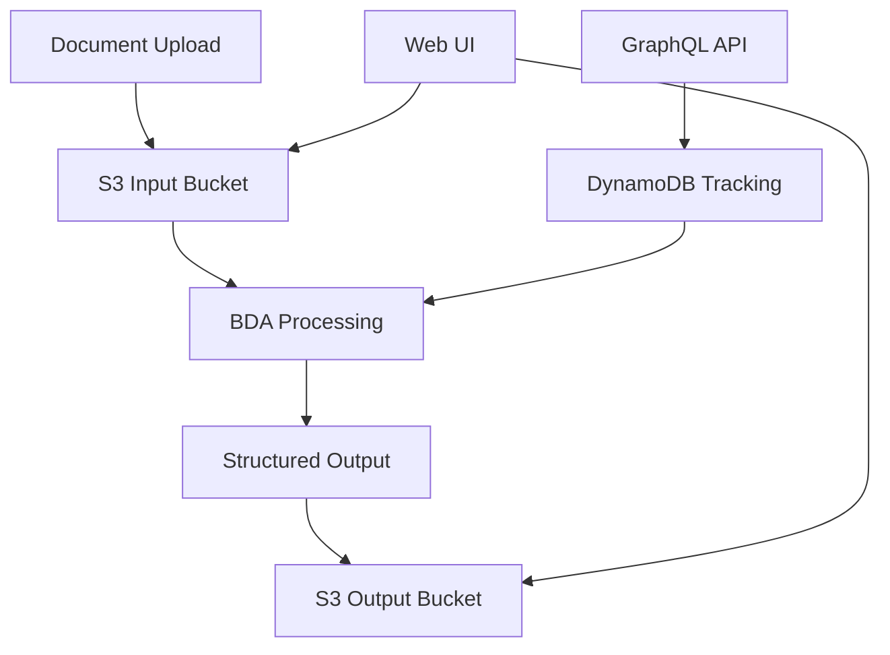

# BDA Processor Example

This example demonstrates how to use Amazon Bedrock Data Automation (BDA) for processing standard document types with managed schemas. It's ideal for enterprise deployments with well-defined document types.

## Overview

The BDA Processor example uses Amazon Bedrock Data Automation to provide:

1. **Managed Processing** → Pre-built schemas for common document types
2. **Enterprise Ready** → Enterprise-grade processing pipeline
3. **Standardized Output** → Consistent data extraction formats
4. **Scalable Architecture** → Handles high document volumes

## Key Differences from Bedrock LLM Processor

| Aspect | BDA Processor | Bedrock LLM Processor |
|--------|---------------|----------------------|
| **Setup** | Requires BDA project creation | Fully automated |
| **Document Types** | Predefined schemas | Fully customizable |
| **Processing** | Managed service | Multi-stage pipeline |
| **Customization** | Schema-based | Full prompt control |
| **Best For** | Standard documents | Custom requirements |

## Quick Start

### 1. Navigate to the Example

```bash
cd examples/bda-processor
```

### 2. Review the Configuration

The example includes configuration files:

```bash
# Ready-to-use configuration
cat terraform.tfvars.example

# Edit with your specific values
cp terraform.tfvars.example terraform.tfvars
vim terraform.tfvars
```

### 3. Prerequisites

Before deploying, you need to:

1. **Create BDA Project**: Set up a BDA project in the AWS Console
2. **Configure Document Types**: Define the document schemas you want to process
3. **Enable Model Access**: Ensure Bedrock model access is enabled

### 4. Deploy

```bash
terraform init
terraform plan
terraform apply
```

## Configuration Options

### Basic Configuration

```hcl
# terraform.tfvars
# Basic Configuration
region = "us-east-1"
prefix = "genai-bda-idp"

# Administrator Configuration
admin_email = "admin@example.com"

# Logging Configuration
log_level          = "INFO"
log_retention_days = 7

# Data Retention
data_tracking_retention_days = 365

# Summarization Feature
summarization_enabled  = true
summarization_model_id = "us.anthropic.claude-3-5-sonnet-20241022-v2:0"

# Evaluation Feature
enable_evaluation   = false
evaluation_model_id = "anthropic.claude-3-sonnet-20240229-v1:0"

# Reporting Feature
enable_reporting = false

# API Configuration
enable_api = true

# Web UI Configuration
web_ui = {
  enabled = true
}

# Tags
tags = {
  Environment = "dev"
  Project     = "genai-idp-accelerator"
}
```

### Advanced Configuration

```hcl
# Enhanced settings for production
region = "us-east-1"
prefix = "prod-bda-idp"
admin_email = "admin@company.com"

# Extended logging retention
log_level          = "INFO"
log_retention_days = 30

# Extended data retention
data_tracking_retention_days = 1095  # 3 years

# Custom configuration file
config_file_path = "../../sources/config_library/pattern-1/lending-package-sample/config.yaml"

# Enable all features
summarization_enabled  = true
summarization_model_id = "us.anthropic.claude-3-5-sonnet-20241022-v2:0"

enable_evaluation   = true
evaluation_model_id = "anthropic.claude-3-sonnet-20240229-v1:0"

enable_reporting = true

# Force Lambda layer rebuild if needed
force_layer_rebuild = false

# Production tags
tags = {
  Environment = "production"
  Project     = "genai-idp-accelerator"
  CostCenter  = "ai-ml"
}
```

## Features

### **Managed Processing**

- Pre-built document schemas
- Automatic data extraction
- Standardized output formats
- Enterprise-grade reliability

### **Document Types Supported**

- Invoices and receipts
- Forms and applications
- Financial statements
- Insurance documents
- Healthcare records

### **Production Features**

- High availability architecture
- Automatic scaling
- Error handling and retry logic
- Comprehensive monitoring

### **Integration Ready**

- GraphQL API for status tracking
- Web UI for document management
- S3 integration for document storage
- DynamoDB for metadata tracking

## Architecture



## Usage Workflow

### 1. Document Upload

```bash
# Upload documents to the input bucket
INPUT_BUCKET=$(terraform output -raw buckets | jq -r '.input_bucket.bucket_name')
aws s3 cp invoice.pdf s3://$INPUT_BUCKET/
```

### 2. Automatic Processing

The BDA processor automatically:

- Detects new documents
- Applies appropriate schema
- Extracts structured data
- Stores results with metadata

### 3. Monitor Progress

```bash
# Check processing status
GRAPHQL_URL=$(terraform output -raw processing_environment | jq -r '.api.graphql_url')
curl -X POST $GRAPHQL_URL \
  -H "Content-Type: application/json" \
  -d '{"query": "query { listDocuments { id status } }"}'
```

### 4. Retrieve Results

```bash
# Download processed results
OUTPUT_BUCKET=$(terraform output -raw buckets | jq -r '.output_bucket.bucket_name')
aws s3 cp s3://$OUTPUT_BUCKET/processed/ . --recursive
```

## BDA Project Setup

### 1. Create BDA Project in AWS Console

1. Navigate to Amazon Bedrock → Data Automation
2. Create a new project
3. Configure document types and schemas
4. Note the project name for Terraform configuration

### 2. Configure Document Schemas

Define the document types you want to process:

- Invoice processing schema
- Form extraction schema
- Custom document types

### 3. Test BDA Project

Validate your BDA project works correctly before deploying the Terraform infrastructure.

## Monitoring and Troubleshooting

### CloudWatch Metrics

- BDA processing success/failure rates
- Document processing latency
- Error rates and types

### Common Issues

#### BDA Project Not Found

```
Error: BDA project 'project-name' not found
```

**Solution**: Verify BDA project exists and name is correct

#### Schema Mismatch

```
Error: Document doesn't match expected schema
```

**Solution**: Review document format and BDA schema configuration

#### Processing Delays

**Symptoms**: Documents uploaded but not processed
**Solution**: Check BDA project status and quotas

## Security Features

### Data Protection

- End-to-end encryption
- Secure document storage
- Access logging and monitoring
- Compliance-ready architecture

### Access Control

- IAM-based permissions
- Cognito user authentication
- API-level security
- Resource-based policies

## Comparison with Other Examples

### When to Use BDA Processor

**Choose BDA Processor when you need**:

- Standard document types (invoices, forms, etc.)
- Managed processing with minimal customization
- Comprehensive solution out of the box
- Enterprise-grade reliability and support

**Choose Bedrock LLM Processor when you need**:

- Custom document types or processing logic
- Full control over AI prompts and models
- Flexible processing pipeline
- Custom business rules

## Next Steps

### Production Deployment

1. **Multi-Environment Setup**: Deploy to dev/staging/prod
2. **Monitoring**: Set up comprehensive monitoring and alerting
3. **Backup**: Implement backup and disaster recovery
4. **Security**: Review and harden security configurations

### Integration

1. **API Integration**: Connect with existing systems
2. **Workflow Integration**: Integrate with business processes
3. **Data Pipeline**: Set up data processing pipelines
4. **Reporting**: Create dashboards and reports

## Support

- **Example Documentation**: Check the [BDA Processor README](../../examples/bda-processor/README.md)
- **Troubleshooting**: Review [troubleshooting guide](../deployment-guides/troubleshooting.md)
- **Community**: Open issues in the repository

## Related Examples

- [Bedrock LLM Processor](bedrock-llm-processor.md) - Alternative with custom processing
- [Processing Environment](processing-environment.md) - Core infrastructure
- [SageMaker UDOP](sagemaker-udop.md) - Advanced custom models
