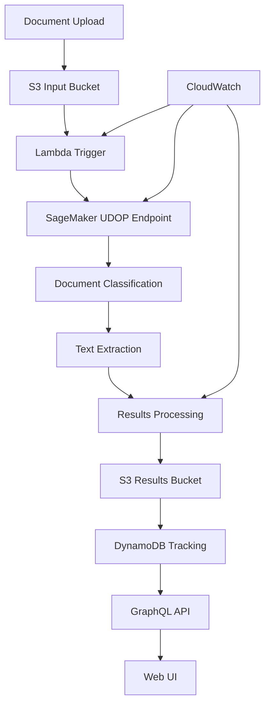

# SageMaker UDOP Processor Example

This example demonstrates how to use the SageMaker UDOP processor to create a specialized document processing pipeline using fine-tuned UDOP (Unified Document Understanding) models on Amazon SageMaker. It's perfect for organizations requiring highly accurate, custom-trained models for specific document types.

## Overview

The SageMaker UDOP Processor example provides:
1. **Document Upload** → S3 bucket triggers processing
2. **Model Deployment** → SageMaker endpoint with fine-tuned UDOP model
3. **Document Analysis** → Custom document classification and extraction
4. **Advanced Processing** → Specialized AI model inference
5. **Results Storage** → Processed results stored with high accuracy metadata
6. **Monitoring** → Comprehensive model performance tracking

## Quick Start

### 1. Navigate to the SageMaker UDOP Processor Example

```bash
cd examples/sagemaker-udop-processor
```

### 2. Use the Minimal Configuration

The example includes a ready-to-use `terraform.tfvars` file for basic deployment:

```hcl
# terraform.tfvars (already provided)
region = "us-east-1"
prefix = "idp-udop"
admin_email = "admin@example.com"
model_instance_type = "ml.m5.large"
log_level = "INFO"
```

### 3. Deploy

```bash
terraform init
terraform plan
terraform apply
```

!!! note "Deployment Time"
    SageMaker UDOP deployment takes 25-35 minutes due to model endpoint creation and initialization.

### 4. Test the Pipeline

```bash
# Upload a test document
INPUT_BUCKET=$(terraform output -raw buckets | jq -r '.input_bucket.bucket_name')
echo "Test document for classification" > test-document.txt
aws s3 cp test-document.txt s3://$INPUT_BUCKET/

# Check results
RESULTS_BUCKET=$(terraform output -raw buckets | jq -r '.results_bucket.bucket_name')
aws s3 ls s3://$RESULTS_BUCKET/
```

## What Gets Deployed

### **Specialized AI Model**
- Fine-tuned UDOP model for document understanding
- Custom document classification capabilities
- High-accuracy text extraction and analysis
- Specialized training and inference infrastructure

### **Production Features**
- SageMaker endpoint with auto-scaling
- Model performance monitoring
- Advanced error handling and retry logic
- Comprehensive logging and metrics

### **Integration Ready**
- GraphQL API for document management
- Web UI for monitoring and results
- Event-driven processing pipeline
- Configurable model parameters

## Architecture



## Configuration Options

### Minimal Configuration (Default)
- Single SageMaker instance
- Basic document processing
- Standard monitoring

### Configuration Setup
```bash
cp terraform.tfvars.example terraform.tfvars
vim terraform.tfvars
```

Includes:
- Multi-instance SageMaker deployment
- Advanced model configuration
- Enhanced monitoring and alerting
- Custom document schemas

### Template Configuration
```bash
cp terraform.tfvars.example terraform.tfvars
# Edit with your specific values
```

## Key Features

### **Custom Model Training**
- Fine-tuned UDOP model for specific document types
- Specialized classification algorithms
- Industry-specific document understanding
- Continuous model improvement capabilities

### **High Accuracy Processing**
- Advanced document layout understanding
- Precise text extraction and classification
- Context-aware document analysis
- Quality assurance and validation

### **Scalable Infrastructure**
- Auto-scaling SageMaker endpoints
- Efficient resource utilization
- Load balancing and failover
- Performance optimization

## Outputs

After deployment, you'll receive:

```bash
# Key infrastructure outputs
terraform output
```

Important outputs include:
- `sagemaker_endpoint`: SageMaker model endpoint name
- `input_bucket_name`: Where to upload documents for processing
- `results_bucket_name`: Where processed results are stored
- `model_performance_dashboard`: CloudWatch dashboard for monitoring
- `api_endpoint`: GraphQL API endpoint (if enabled)

## Monitoring and Troubleshooting

### SageMaker Metrics
- Model inference latency
- Endpoint utilization
- Error rates and model accuracy
- Processing throughput

### Common Issues

#### SageMaker Endpoint Creation Failed
```
Error: SageMaker endpoint failed to create
```
**Solution**: Check instance type availability in your region and verify service limits

#### Model Loading Timeout
```
Error: Model failed to load within timeout period
```
**Solution**: Increase endpoint creation timeout or use larger instance type

#### High Inference Latency
```
Warning: Model inference taking longer than expected
```
**Solution**: Consider using GPU instances or optimizing model configuration

### Getting Help

If you encounter issues:
1. Check SageMaker endpoint status in AWS Console
2. Review CloudWatch logs for detailed error messages
3. Verify model artifacts and configuration
4. Check [troubleshooting guide](../deployment-guides/troubleshooting.md)

## Cleanup

When you're done testing:

```bash
terraform destroy
```

!!! warning "Resource Cleanup"
    SageMaker endpoints incur costs while running. Make sure to destroy resources when not in use.

## Next Steps

- Explore [custom model training](../deployment-guides/custom-models.md)
- Learn about [model optimization](../deployment-guides/performance-tuning.md)
- See [advanced configurations](../deployment-guides/advanced-setup.md)
- Review [monitoring best practices](../deployment-guides/monitoring.md)
