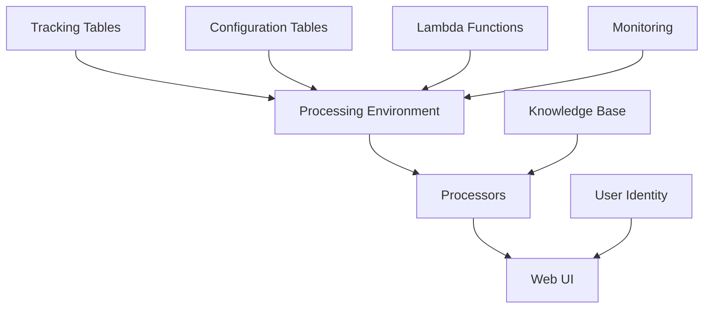

# Terraform Modules

The GenAI IDP Accelerator provides a comprehensive set of Terraform modules designed to work together to create **Intelligent Document Processing** solutions. Each module is designed to be modular, reusable, and configurable to meet different use cases.

## Module Architecture

The modules follow a layered architecture approach:

## Core Infrastructure Modules

### Processing Environment
**Purpose**: Core infrastructure for document processing workflows

**Key Features**:
- S3 buckets for document storage
- SQS queues for workflow management
- EventBridge for event routing
- Lambda functions for processing coordination

**Use Cases**:
- Foundation for all document processing
- Event-driven workflows
- Scalable processing infrastructure

### Processing Environment API
**Purpose**: GraphQL API for document management and monitoring

**Key Features**:
- AppSync GraphQL API
- Lambda resolvers for data operations
- Document status tracking
- Configuration management

**Use Cases**:
- Web UI backend
- API integrations
- Document status monitoring

### User Identity
**Purpose**: Authentication and authorization using Amazon Cognito

**Key Features**:
- Cognito User Pool configuration
- Admin user setup
- Domain configuration
- Security policies

**Use Cases**:
- Web UI authentication
- API access control
- User management

## Data Management Modules

### Tracking Table
**Purpose**: DynamoDB table for document processing status tracking

**Key Features**:
- Document lifecycle tracking
- Processing status management
- Metadata storage
- Query optimization

**Use Cases**:
- Document status monitoring
- Processing history
- Audit trails

### Configuration Table
**Purpose**: DynamoDB table for system configuration management

**Key Features**:
- Processor configuration storage
- Dynamic configuration updates
- Environment-specific settings
- Configuration versioning

**Use Cases**:
- Processor settings
- Feature flags
- Environment configuration

### Concurrency Table
**Purpose**: DynamoDB table for managing processing concurrency

**Key Features**:
- Concurrency limit enforcement
- Resource allocation tracking
- Queue management
- Performance optimization

**Use Cases**:
- Rate limiting
- Resource management
- Performance tuning

## Processing Modules

### Processors
**Purpose**: Document processing implementations

**Available Processors**:
- **BDA Processor**: Amazon Bedrock Data Automation
- **Bedrock LLM Processor**: Custom Bedrock LLM processing
- **SageMaker UDOP Processor**: SageMaker UDOP model

### Processor Attachment
**Purpose**: Integration layer for connecting processors to the processing environment

**Key Features**:
- EventBridge rule configuration
- Lambda function deployment
- IAM role management
- Processor lifecycle management

**Use Cases**:
- Processor integration
- Event routing
- Processing coordination

## Supporting Modules

### Lambda Functions
**Purpose**: Core Lambda functions for document processing workflows

**Key Features**:
- Queue processing functions
- Document status tracking
- Workflow coordination
- Error handling

**Use Cases**:
- Processing orchestration
- Status updates
- Error recovery

### Lambda Layer CodeBuild
**Purpose**: Build Lambda layers using AWS CodeBuild

**Key Features**:
- Automated layer building
- Dependency management
- Multi-architecture support
- Version management

**Use Cases**:
- Python dependency packaging
- Layer automation
- Build optimization

### IDP Common Layer
**Purpose**: Shared Lambda layer for common IDP functionality

**Key Features**:
- Common utilities and libraries
- Shared configuration
- Error handling utilities
- Logging standardization

**Use Cases**:
- Code reuse
- Standardization
- Maintenance efficiency

### Web UI
**Purpose**: Web interface for document management and monitoring

**Key Features**:
- React-based frontend
- S3 static hosting
- CloudFront distribution
- Authentication integration

**Use Cases**:
- Document upload interface
- Processing monitoring
- User management

### Knowledge Base
**Purpose**: Integration with Amazon Bedrock Knowledge Base

**Key Features**:
- Vector database integration
- Document indexing
- Semantic search
- RAG (Retrieval Augmented Generation)

**Use Cases**:
- Document search
- Context-aware processing
- Knowledge retrieval

### Monitoring
**Purpose**: CloudWatch monitoring and alerting

**Key Features**:
- Custom metrics
- Dashboards
- Alarms and notifications
- Performance monitoring

**Use Cases**:
- System monitoring
- Performance optimization
- Alerting

## Module Dependencies

Understanding module dependencies is crucial for proper deployment:

| Module | Dependencies | Optional Dependencies |
|--------|-------------|---------------------|
| Processing Environment | None | Monitoring |
| Processors | Processing Environment | Knowledge Base |
| Web UI | Processing Environment, User Identity | Monitoring |
| Processing Environment API | Processing Environment | User Identity |
| Processor Attachment | Processing Environment, Processor | None |

## Configuration Variables

Most modules share common configuration patterns:

### Common Variables
- `prefix`: Resource naming prefix
- `region`: AWS region
- `tags`: Resource tags
- `log_level`: Logging level

### Environment-Specific Variables
- `admin_email`: Administrator email address
- `enable_monitoring`: Enable CloudWatch monitoring
- `enable_web_ui`: Deploy web interface
- `custom_domain`: Custom domain configuration

For detailed variable documentation, see individual module pages in the repository.

## Getting Started

1. **Start with Core Infrastructure**: Deploy Processing Environment module
2. **Add Processing Capability**: Choose and deploy a Processor module
3. **Enable User Interface**: Add User Identity and Web UI modules
4. **Add Monitoring**: Deploy Monitoring module

For complete examples, see the [Examples](../examples/index.md) section.

## Best Practices

### Module Organization
- Use consistent naming conventions
- Group related resources in modules
- Implement proper dependency management
- Use module versioning for production

### Configuration Management
- Use Terraform workspaces for environments
- Implement proper variable validation
- Use remote state storage
- Enable state locking

### Security
- Follow least privilege principles
- Enable encryption at rest and in transit
- Use IAM roles instead of users
- Implement proper network security

For more detailed guidance, see the [Best Practices](../deployment-guides/best-practices.md) guide.
